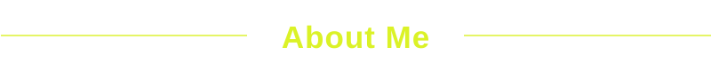
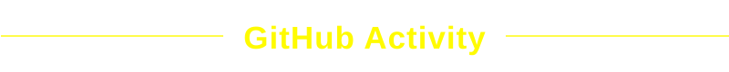
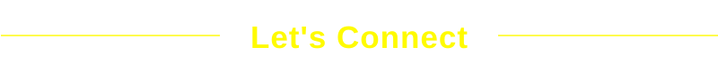

  

Hi! I'm Fran, a Computer Science student at FIAP, building my
foundation as a Software Developer while exploring different areas
of technology.

My journey in tech started at ETEC, where I completed High School
integrated with a Technical Program in Electronics. I also completed
a separate Technical Program in Systems Development at ETEC, which
strengthened my interest in software and programming.

I'm expanding my knowledge in software development, from backend
and databases to web technologies and user interfaces. I'm
particularly interested in understanding how different parts of a
system work together to turn ideas into real products.

Right now, my focus is on learning, building projects and continuously
improving my skills as I shape my path in software development.

This GitHub is a collection of that journey.

  

  
  
  
  

  
  
  

  
  
  
  

  

<!--

  

  

-->

  

  

  
  
  

  Always open to new ideas, collaborations and opportunities.

 

  
  

  <i>Building, learning and debugging my way forward.</i>

  

